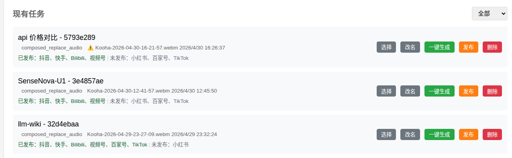

# Auto Video Studio 视频工作平台

一个功能完整的自动化视频处理工作台，支持视频裁剪、字幕编辑、AI 配音和多平台发布。

我已经流畅在多个平台发布了自己录制的视频，所以现在开源出来。

使用环境：Ubuntu 24,amd hx370 cpu,48G内存。其它需要自行测试

## 特别感谢
1、改造了项目social-auto-upload的自动发布能力：https://github.com/dreammis/social-auto-upload
2、bilibili-all-in-one项目修改为WEB支持：https://clawhub.ai/wscats/bilibili-all-in-one

## 功能特性

### 视频处理
- **语音转写**：使用 Whisper 自动识别视频中的语音并生成字幕
- **静音裁剪**：自动检测并裁剪视频中的静音片段
- **视频裁剪**：支持按字幕标记或手工时间段裁剪视频片段

### 字幕编辑
- **词库替换**：支持自定义词库进行术语替换
- **人工校正**：可视化字幕编辑界面
- **AI 辅助**：集成 AI 模型辅助字幕校正

### TTS 配音
- **语音克隆**：支持 CosyVoice、IndexTTS2 等模型进行声音克隆
- **变声处理**：集成 Seed-VC 进行声音转换
- **并行生成**：支持多进程并行生成音频片段

### 视频合成
- **字幕烧录**：将字幕嵌入视频画面
- **音频替换**：用 TTS 生成的配音替换原视频音频
- **音频优化**：支持原声音频优化处理

### 多平台发布
支持一键发布到多个社交媒体平台：

| 平台 | 图标 | 支持功能 |
|------|------|----------|
| 抖音 | 🎵 | 视频、图文、定时发布 |
| 快手 | 🦊 | 视频、图文、定时发布 |
| 小红书 | 📕 | 视频、图文、定时发布、草稿 |
| B站 | 📺 | 视频、定时发布、分区 |
| 视频号 | 📱 | 视频、定时发布 |
| 百家号 | 📰 | 视频、定时发布 |
| TikTok | 🎬 | 视频、定时发布 |

## 功能截图

### 任务列表


### 字幕编辑


### tts可以克隆声音


### 发布视频
可以用ai生成标题、内容


### 视频封面
可以调用浏览器生成封面


## 技术栈

- **后端**：Python 3.12 + FastAPI + Uvicorn
- **前端**：HTML + JavaScript + Jinja2 模板
- **AI 模型**：Whisper、CosyVoice、IndexTTS2、Seed-VC
- **数据库**：SQLite
- **视频处理**：FFmpeg

## 项目结构

```
auto-video-studio/
├── config/                 # 配置文件目录
│   ├── ai_models.json      # AI 模型配置
│   ├── social_platforms.json # 社交平台配置
│   ├── replace_terms.json  # 词库替换配置
│   └── tts_runtime_profiles.json # TTS 运行时配置
├── core/                   # 核心功能模块
│   ├── third_party/        # 第三方模型
│   │   ├── CosyVoice/      # CosyVoice 语音合成
│   │   └── index-tts/      # IndexTTS2 语音合成
│   ├── tools/              # 工具脚本
│   │   ├── seed-vc/        # Seed-VC 变声工具
│   │   ├── cosyvoice_voiceover.py
│   │   └── indextts2_voiceover.py
│   └── video/              # 视频处理
│       └── video_factory.py
├── web/                    # Web 应用
│   ├── backend/            # 后端服务
│   │   ├── app.py          # FastAPI 应用入口
│   │   ├── routers/        # API 路由
│   │   └── services/       # 业务服务
│   └── frontend/           # 前端资源
│       ├── static/         # 静态文件
│       └── templates/      # 页面模板
├── videos/                 # 视频任务目录
│   └── web_jobs/           # 任务存储
├── docs/                   # 文档目录
│   ├── 01-需求/            # 需求文档
│   ├── 02-开发/            # 开发文档
│   └── 03-发布流程/        # 发布流程文档
└── data/                   # 数据目录
    └── app.db              # SQLite 数据库
```

## 快速开始

### 环境要求

- Python 3.12+
- FFmpeg
- CUDA 或 ROCm（GPU 加速，可选）

### 安装步骤

1. 克隆项目
```bash
git clone https://github.com/your-username/auto-video-studio.git
cd auto-video-studio
```

2. 创建虚拟环境
```bash
python -m venv .venv
source .venv/bin/activate
```

3. 安装依赖
```bash
pip install -r web/backend/requirements.txt
```

4. 安装 Whisper（用于语音转写）
```bash
pip install openai-whisper
```

5. 启动服务
```bash
./docs/run.sh
```

或手动启动：
```bash
cd web/backend
python -m uvicorn app:app --host 127.0.0.1 --port 1894 --reload
```

6. 访问 Web 界面
```
http://127.0.0.1:1894
```

### 环境变量

| 变量名 | 说明 | 默认值 |
|--------|------|--------|
| `AUTO_CUT_HOST` | 服务监听地址 | `127.0.0.1` |
| `AUTO_CUT_PORT` | 服务监听端口 | `1894` |
| `AUTO_CUT_PYTHON` | Python 解释器路径 | 自动检测 |
| `AUTO_CUT_MAX_BODY_SIZE` | 请求体最大大小 | `524288000` (500MB) |

## 使用流程

### 推荐操作顺序

1. **上传视频**：在「任务列表」页面上传原始视频
2. **视频处理**：执行转写和静音压缩，生成初始字幕
3. **字幕编辑**：应用词库替换并人工校正，保存最终字幕
4. **选择路线**：
   - **原声路线**：视频裁剪 → 视频合成
   - **TTS 路线**：TTS 配音 → 视频合成
5. **社媒发布**：选择平台、填写文案、发布视频

### 原声路线

适用于保留原视频音频的场景：

1. 在「字幕编辑」勾选不需要的字幕片段
2. 在「视频裁剪」执行裁剪
3. 在「视频合成」进行音频优化（可选）和字幕烧录

### TTS 路线

适用于需要配音的场景：

1. 在「字幕编辑」保存最终字幕
2. 配置 TTS 参数（参考音频、模型等）
3. 生成配音音频
4. 合成最终视频

## TTS 配置说明

### 参数说明

| 参数 | 说明 |
|------|------|
| `prompt_wav` | 参考音频文件 |
| `prompt_text` | 参考音频文字（zero_shot 模式必填） |
| `tts_mode` | `cross_lingual` 或 `zero_shot` |
| `segment_mode` | `ai`（AI 分段）或 `rule`（规则分段） |
| `model_name` | 模型名称 |
| `model_dir` | 模型目录 |
| `speed` | 语速参数 |
| `parallel` | 并行进程数 |
| `threads` | 每进程 CPU 线程数 |

### 性能建议

- AMD/ROCm 环境：建议 `parallel=3`，`threads=4`
- NVIDIA/CUDA 环境：可适当提高 `parallel` 值

## 社媒发布

### 支持的登录方式

| 平台 | 登录方式 |
|------|----------|
| 抖音 | 浏览器 headed 模式 |
| 快手 | 浏览器 headed 模式 |
| 小红书 | 浏览器 headed 模式 |
| B站 | 终端命令行 |
| 视频号 | 浏览器 headed 模式 |
| 百家号 | 浏览器 headed 模式 |
| TikTok | 浏览器 headed 模式 |

### 发布流程

1. 在「社媒发布」页面添加账号
2. 扫码或登录授权
3. 选择视频任务
4. 生成或填写发布文案
5. 选择发布时间（支持定时发布）
6. 执行发布

## API 接口

主要 API 端点：

| 方法 | 路径 | 说明 |
|------|------|------|
| POST | `/api/jobs` | 创建任务 |
| POST | `/api/jobs/{job_id}/process-video` | 处理视频 |
| GET | `/api/jobs/{job_id}/captions` | 获取字幕 |
| POST | `/api/jobs/{job_id}/captions` | 保存字幕 |
| POST | `/api/jobs/{job_id}/generate-tts` | 生成 TTS |
| POST | `/api/jobs/{job_id}/compose` | 合成视频 |
| POST | `/api/social/{platform}/upload` | 发布视频 |

## 开发

### 运行开发服务器

```bash
cd web/backend
python -m uvicorn app:app --reload
```

### 运行测试

```bash
pytest
```

### 代码检查

```bash
ruff check .
```

## 许可证

MIT License

## 贡献

欢迎提交 Issue 和 Pull Request！

## 致谢

- [Whisper](https://github.com/openai/whisper) - OpenAI 语音识别
- [CosyVoice](https://github.com/FunAudioLLM/CosyVoice) - 语音合成
- [IndexTTS](https://github.com/index-tts/index-tts) - 语音合成
- [Seed-VC](https://github.com/Plachtaa/seed-vc) - 声音转换
